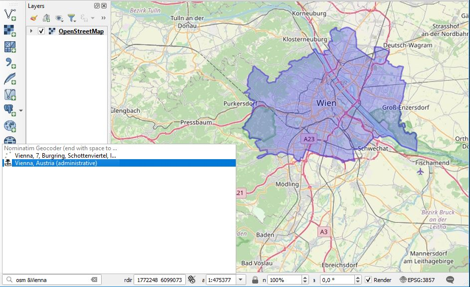

QGIS Nominatim Locator Filter Plugin
====================================

This is a so called QgsLocator filter for the Nominatim/OpenStreetMap search service, 
implemented as a QGIS plugin.

Read about writing one here:

http://www.qgis.nl/2018/05/16/english-coding-a-qgslocator-plugin/

This Locator Filter searches for names in the Nominatim service:

see https://operations.osmfoundation.org/policies/nominatim/

You can install this 'Locator Filter' as a plugin by searching for it in 
the QGIS plugin manager in your QGIS desktop, search for 'Nominatim':

http://plugins.qgis.org/plugins/nominatim_locator_filter/

Some more docs and api's:

http://api.qgis.org/api/master/html/classQgisInterface.html

http://python.qgis.org/api/core/Locator/QgsLocator.html

http://python.qgis.org/api/core/Locator/QgsLocatorFilter.html

QGIS Nominatim Locator Extensions
=================================

1) Show icons with the search results to visualize the geometry types. This simplifies the selection of the search result.

2) Show result in map canvas using QgsRubberBand.

3) Support Global and local search. Use & for local search (i.e. "osm &Vienna ").

Global search:

Local search (restricts results to map canvas extents):

